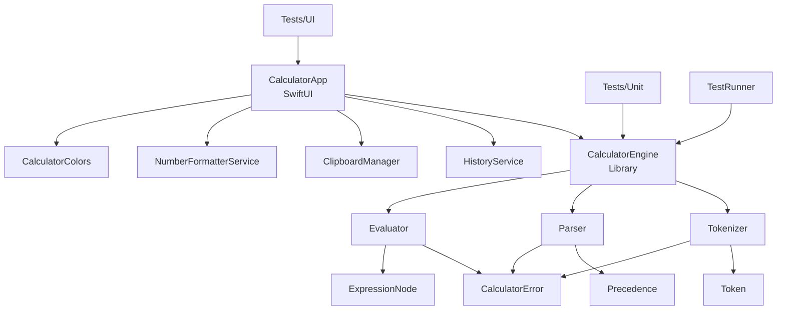
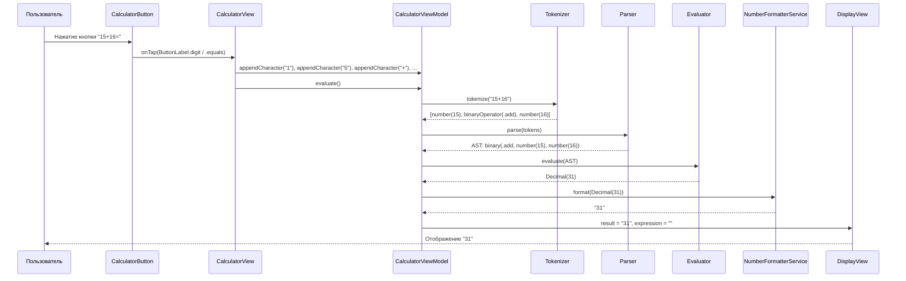

# Техническая документация: GateCalc

**Проект:** GateCalc — macOS-калькулятор  
**Дата:** 5 июля 2026  
**Аудитор:** MimoCode (автоматический аудит)

---

## Содержание

1. [Обзор проекта](#1-обзор-проекта)
2. [Архитектура](#2-архитектура)
3. [Вычислительный движок (CalculatorEngine)](#3-вычислительный-движок-calculatorengine)
4. [UI-слой (Views)](#4-ui-слой-views)
5. [ViewModel (CalculatorViewModel)](#5-viewmodel-calculatorviewmodel)
6. [Сервисы](#6-сервисы)
7. [Тема и локализация](#7-тема-и-локализация)
8. [Тестирование](#8-тестирование)
9. [Сборка и запуск](#9-сборка-и-запуск)
10. [Известные проблемы и ограничения](#10-известные-проблемы-и-ограничения)
11. [Реестр исправлений](#11-реестр-исправлений)
12. [Метрики проекта](#12-метрики-проекта)

---

## 1. Обзор проекта

| Параметр | Значение |
|---|---|
| Название | GateCalc |
| Платформа | macOS |
| Минимальная версия | macOS 14.0 (Sonoma) |
| Swift-tools-version | 6.0 |
| Идентификатор бандла | `com.gatecalc.calculator` |
| Архитектурный стиль | MVVM + вычислительный движок как отдельный модуль |

**Назначение:** Настольный калькулятор для macOS, вдохновлённый Calculator.app из macOS Tahoe (26). Поддерживает базовую арифметику, проценты, константы (π, e), числа в шестнадцатеричном/двоичном/восьмеричном формате, экспоненциальную запись, историю вычислений и буфер обмена.

### Список всех файлов

#### CalculatorEngine (8 файлов, 762 строки)

| Файл | Строки | Назначение |
|---|---|---|
| `Sources/CalculatorEngine/CalculatorEngine.swift` | 42 | Фасад вычислительного движка: строка → токены → AST → Decimal |
| `Sources/CalculatorEngine/Tokenizer/Token.swift` | 19 | Определения типов токенов: `Token`, `BinaryOperator` |
| `Sources/CalculatorEngine/Tokenizer/Tokenizer.swift` | 381 | Токенизатор: предобработка строки, разбиение на токены, чтение чисел (десятичные, hex/bin/oct, экспоненциальные), константы, валидация |
| `Sources/CalculatorEngine/Parser/Parser.swift` | 134 | Парсер: алгоритм сортировочной станции (Shunting Yard) → RPN → AST |
| `Sources/CalculatorEngine/Parser/Precedence.swift` | 66 | Приоритеты операторов, ассоциативность, вспомогательные свойства Token |
| `Sources/CalculatorEngine/AST/ExpressionNode.swift` | 16 | Определение AST: `indirect enum` с вариантами `number`, `unaryMinus`, `binary` |
| `Sources/CalculatorEngine/Evaluator/Evaluator.swift` | 41 | Вычислитель AST: рекурсивный обход, деление на ноль |
| `Sources/CalculatorEngine/Errors/CalculatorError.swift` | 63 | Перечисление ошибок с локализованными описаниями |

#### Приложение (11 файлов, 1111 строк)

| Файл | Строки | Назначение |
|---|---|---|
| `Sources/App/CalculatorApp.swift` | 118 | Точка входа `@main`, WindowGroup, KeyHandlerNSView (NSViewRepresentable) для клавиатурного ввода |
| `Sources/Views/CalculatorView.swift` | 166 | Главный вид: сетка кнопок 4×7, обработчик нажатий |
| `Sources/Views/CalculatorButton.swift` | 203 | Компонент кнопки: типы, метки (ButtonLabel), анимация, AnyShape, Accessibility |
| `Sources/Views/DisplayView.swift` | 139 | Дисплей: выражение, результат, ошибка; адаптивный шрифт, анимации (shake, flash) |
| `Sources/Views/HistoryPanelView.swift` | 54 | Панель истории: NavigationStack, ContentUnavailableView |
| `Sources/ViewModels/CalculatorViewModel.swift` | 233 | ViewModel: состояние, методы ввода, вычисления, памяти, буфера обмена, истории |
| `Sources/Services/HistoryService.swift` | 44 | Сервис истории: singleton, NSLock, maxEntries=50, in-memory |
| `Sources/Clipboard/ClipboardManager.swift` | 32 | Менеджер буфера обмена: singleton, NSLock, NSPasteboard |
| `Sources/Formatting/NumberFormatterService.swift` | 47 | Форматирование чисел: decimal/scientific, en_US локаль |
| `Sources/Theme/CalculatorColors.swift` | 46 | Цветовая система по образцу Calculator.app macOS Tahoe |
| `Sources/History/HistoryEntry.swift` | 29 | Модель записи истории: expression, result (Decimal), timestamp |

#### TestRunner (1 файл, 174 строки)

| Файл | Строки | Назначение |
|---|---|---|
| `Sources/TestRunner/main.swift` | 174 | Консольный прогон всех тестов без XCTest |

#### Тесты (5 файлов, 1013 строк)

| Файл | Строки | Назначение |
|---|---|---|
| `Tests/Unit/TokenizerTests.swift` | 223 | 27 тестов токенизатора |
| `Tests/Unit/ParserTests.swift` | 211 | 12 тестов парсера |
| `Tests/Unit/EvaluatorTests.swift` | 153 | 17 тестов вычислителя |
| `Tests/Unit/CalculatorEngineTests.swift` | 275 | 45 интеграционных тестов движка |
| `Tests/UI/CalculatorUITests.swift` | 151 | 11 UI-тестов (XCUITest) |

#### Конфигурация и сборка (2 файла, 124 строки)

| Файл | Строки | Назначение |
|---|---|---|
| `Package.swift` | 59 | Конфигурация Swift Package: 4 таргета, зависимости, ресурсы |
| `build_app.sh` | 65 | Скрипт сборки .app-бандла |

#### Локализация (2 файла)

| Файл | Назначение |
|---|---|
| `Sources/Localization/en.lproj/Localizable.strings` | Английская локализация (31 строка) |
| `Sources/Localization/ru.lproj/Localizable.strings` | Русская локализация (31 строка) |

---

## 2. Архитектура

### 2.1. Диаграмма зависимостей модулей



### 2.2. Поток данных: от нажатия кнопки до отображения результата



### 2.3. Разделение ответственности

| Класс / Структура | Ответственность |
|---|---|
| `CalculatorApp` | Точка входа, создание WindowGroup, настройка размера окна, инъекция KeyHandlerNSView |
| `KeyHandlerNSView` | Перехват нажатий клавиатуры (NSView), делегирование в ViewModel |
| `KeyHandlerView` | NSViewRepresentable-обёртка для KeyHandlerNSView |
| `CalculatorView` | Главный вид: компоновка сетки кнопок, передача нажатий в ViewModel |
| `CalculatorButton` | Визуализация одной кнопки: цвет, форма, анимация нажатия, Accessibility |
| `DisplayView` | Отображение выражения/результата/ошибки, адаптивный шрифт, анимации |
| `HistoryPanelView` | Панель истории: навигация, список записей, ContentUnavailableView |
| `CalculatorViewModel` | Состояние приложения, методы ввода/вычисления/памяти/буфера обмена |
| `CalculatorEngine` | Фасад: полный цикл вычисления строки |
| `Tokenizer` | Лексический анализ: строка → массив токенов |
| `Parser` | Синтаксический анализ: токены → RPN → AST |
| `Evaluator` | Вычисление AST → Decimal |
| `HistoryService` | Хранение истории вычислений (in-memory, max 50) |
| `ClipboardManager` | Чтение/запись строк в системный буфер обмена |
| `NumberFormatterService` | Форматирование Decimal → строку (decimal/scientific) |
| `CalculatorColors` | Цветовая палитра приложения |
| `HistoryEntry` | Модель данных записи истории |

### 2.4. Паттерны проектирования

#### Facade (Фасад) — `CalculatorEngine`

Вычислительный движок скрывает сложность трёх компонентов (Tokenizer, Parser, Evaluator) за единым методом `evaluate(_ expression: String) throws -> Decimal`. Клиент (ViewModel) вызывает один метод, не зная о внутренней конвейерной обработке.

#### MVVM (Model-View-ViewModel)

- **Model:** `HistoryEntry`, `ExpressionNode`, `Token`, `CalculatorError`
- **View:** `CalculatorView`, `DisplayView`, `CalculatorButton`, `HistoryPanelView`
- **ViewModel:** `CalculatorViewModel` — `@Observable`, `@MainActor`

Связь View ↔ ViewModel осуществляется через `@Bindable` (SwiftUI) и `@Observable` (Observation framework). ViewModel не ссылается на View напрямую.

#### Singleton (Одиночка)

- `HistoryService.shared` — singleton с NSLock
- `ClipboardManager.shared` — singleton с NSLock
- `NumberFormatterService.shared` — singleton (Sendable struct)

#### NSViewRepresentable (Мост SwiftUI ↔ AppKit)

`KeyHandlerView` — обёртка, позволяющая SwiftUI-приложению перехватывать низкоуровневые события клавиатуры через `NSView.keyDown(with:)`.

### 2.5. Потокобезопасность

| Механизм | Где применяется | Зачем |
|---|---|---|
| `NSLock` | `HistoryService` | Синхронизация доступа к массиву `entries` при конкурентных чтениях/записях |
| `NSLock` | `ClipboardManager` | Синхронизация доступа к `NSPasteboard` (не потокобезопасный API) |
| `@MainActor` | `CalculatorViewModel` | Все обновления UI-состояния происходят на главном потоке |
| `@MainActor` | `KeyHandlerNSView` | Методы `keyDown` и `performKeyEquivalent` вызываются на главном потоке |
| `@unchecked Sendable` | `HistoryService`, `ClipboardManager` | Статический анализатор не может проверить NSLock — ручная пометка |
| `Sendable` | `CalculatorEngine`, `Tokenizer`, `Parser`, `Evaluator` | Вычислительный движок полностью потокобезопасен |

---

## 3. Вычислительный движок (CalculatorEngine)

Вычислительный движок — независимый Swift-модуль без зависимостей от SwiftUI или AppKit. Представляет собой конвейер из четырёх этапов:

```
Строка → [Предобработка] → [Токенизация] → [Парсинг (Shunting Yard → RPN → AST)] → [Вычисление] → Decimal
```

### 3.1. CalculatorEngine (Фасад)

**Файл:** `Sources/CalculatorEngine/CalculatorEngine.swift` (42 строки)

```swift
public struct CalculatorEngine: Sendable {
    public init() {}
    
    public func evaluate(_ expression: String) throws -> Decimal {
        let trimmed = expression.trimmingCharacters(in: .whitespacesAndNewlines)
        guard !trimmed.isEmpty else { throw CalculatorError.emptyExpression }
        
        let tokenizer = Tokenizer()
        let tokens = try tokenizer.tokenize(trimmed)
        guard !tokens.isEmpty else { throw CalculatorError.emptyExpression }
        
        let parser = Parser()
        let ast = try parser.parse(tokens)
        
        let evaluator = Evaluator()
        return try evaluator.evaluate(ast)
    }
}
```

Структура `Sendable` — потокобезопасна. Каждый вызов создаёт новые экземпляры Tokenizer/Parser/Evaluator (stateless), что гарантирует отсутствие состояния между вызовами.

### 3.2. Token (Типы токенов)

**Файл:** `Sources/CalculatorEngine/Tokenizer/Token.swift` (19 строк)

```swift
public enum Token: Equatable, Sendable {
    case number(Decimal)
    case binaryOperator(BinaryOperator)
    case unaryMinus
    case leftParenthesis
    case rightParenthesis
    case percent
}

public enum BinaryOperator: String, Sendable {
    case add = "+"
    case subtract = "-"
    case multiply = "*"
    case divide = "/"
}
```

**Полный список токенов:**

| Токен | Пример | Описание |
|---|---|---|
| `number(Decimal)` | `15`, `3.14`, `0xFF` | Числовое значение (любой поддерживаемый формат) |
| `binaryOperator(.add)` | `+` | Бинарное сложение |
| `binaryOperator(.subtract)` | `-` | Бинарное вычитание |
| `binaryOperator(.multiply)` | `*` | Бинарное умножение |
| `binaryOperator(.divide)` | `/` | Бинарное деление |
| `unaryMinus` | `-5` | Унарный минус |
| `leftParenthesis` | `(` | Открывающая скобка |
| `rightParenthesis` | `)` | Закрывающая скобка |
| `percent` | `%` | Процент (деление на 100) |

### 3.3. Tokenizer (Токенизатор)

**Файл:** `Sources/CalculatorEngine/Tokenizer/Tokenizer.swift` (381 строка)

#### Предварительная обработка (`preprocess`)

1. **Удаление "="** — если в конце строки стоит "=", он удаляется (последний символ).
2. **Обработка переносов** — всё после первого `\n` отбрасывается (только первая строка).
3. **Нормализация запятых** — если строка содержит запятую, но не содержит точку, и все символы — цифры/запятые, запятые удаляются как разделители тысяч (например, `1,000,000` → `1000000`).
4. **Проверка NaN/Infinity** — если строка (в нижнем регистре) равна `"nan"` или `"infinity"`, выбрасывается ошибка.

#### Чтение чисел

Метод `readNumber` обрабатывает несколько форматов:

| Формат | Пример | Описание |
|---|---|---|
| Десятичные | `3.14`, `0.5` | Обычные числа с плавающей точкой |
| Экспоненциальные | `1.5e3`, `1.5e-3` | С научной нотацией (e/E, опциональный +/-) |
| Hex | `0xFF`, `0XAB` | Шестнадцатеричные ( префикс `0x`/`0X`, поддержка `_`) |
| Binary | `0b1010` | Двоичные (префикс `0b`, только 0/1, поддержка `_`) |
| Octal | `0o77` | Восьмеричные (префикс `0o`, цифры 0-7, поддержка `_`) |

**Исправление C-07:** Если индекс не продвинулся при чтении числа, выбрасывается ошибка вместо возврата `(0, start)`, что предотвращало бесконечный цикл.

#### Константы

| Константа | Символ | Значение | Реализация |
|---|---|---|---|
| Число Пи | `π` (U+03C0) | `Decimal.pi` | Стандартная константа Foundation |
| Число Эйлера | `e` | ~2.71828 | Разложение в ряд Тейлора (30 слагаемых) |

**Вычисление e:**

```swift
private static let eulerNumber: Decimal = {
    var result = Decimal(1)
    var factorial = Decimal(1)
    for i in 1..<30 {
        factorial *= Decimal(i)
        result += Decimal(1) / factorial
    }
    return result
}()
```

Формула: `e = 1 + 1/1! + 1/2! + 1/3! + ... + 1/29!`

#### Различение унарного и бинарного минуса

Минус считается **унарным**, если:
- Он стоит в начале строки (`tokens.isEmpty`)
- Предыдущий токен — оператор или открывающая скобка

Во всех остальных случаях минус — **бинарный**.

```swift
let isUnary = tokens.isEmpty || lastTokenIsOperatorOrLeftParen(tokens)
```

#### Валидация последовательности токенов (`validateTokenSequence`)

После токенизации проверяется корректность последовательности:
- Двойные операторы (кроме допустимых комбинаций)
- `%` после оператора или другой `%`
- `)` после оператора или `(`
- Унарный минус после другой операции (кроме бинарного оператора)

### 3.4. Parser (Парсер)

**Файл:** `Sources/CalculatorEngine/Parser/Parser.swift` (134 строки)

#### Алгоритм сортировочной станции (Shunting Yard)

Алгоритм Дейкстры для преобразования инфикса в обратную польскую нотацию (RPN, Reverse Polish Notation).

```swift
private func toRPN(_ tokens: [Token]) throws -> [Token]
```

**Правила обработки токенов:**

| Токен | Действие |
|---|---|
| `number` | Напрямую в выходной буфер |
| `leftParenthesis` | В стек операторов |
| `rightParenthesis` | Выталкивает из стека до `(`; если `(` не найдена — ошибка `extraClosingParenthesis` |
| `binaryOperator` | Выталкивает операторы с >= приоритетом, затем кладёт себя в стек |
| `unaryMinus` | Выталкивает операторы с > приоритетом (правая ассоциативность), затем кладёт себя |
| `percent` | Выталкивает операторы с > приоритетом, затем **сразу** в выходной буфер (не в стек) |

**Обработка остатка стека:** Если в стеке остались `(` — ошибка `missingClosingParenthesis`. Если `)` — ошибка `extraClosingParenthesis`.

#### Построение AST из RPN

```swift
private func buildAST(from rpn: [Token]) throws -> ExpressionNode
```

| Токен в RPN | Действие |
|---|---|
| `number` | Создаётся листовой узел `.number(value)` |
| `binaryOperator` | Вынимаются два верхних узла, создаётся `.binary(op, left, right)` |
| `unaryMinus` | Вынимается один узел, создаётся `.unaryMinus(value)` |
| `percent` | Вынимается один узел, создаётся `.binary(.divide, value, .number(100))` |

**Percent трансформация:** Токен `%` заменяется на `value / 100`. Например, `50%` → AST для `50/100` → `0.5`.

#### Приоритеты операторов

**Файл:** `Sources/CalculatorEngine/Parser/Precedence.swift` (66 строк)

| Приоритет | Операция | Ассоциативность | Raw Value |
|---|---|---|---|
| `addition` | `+`, `-` | Левая | 1 |
| `multiplication` | `*`, `/` | Левая | 2 |
| `unaryMinus` | `-` (унарный) | **Правая** | 3 |
| `percent` | `%` | Левая | 2 |

**Важно:** unaryMinus имеет приоритет (3), выше чем `*`/`/` (приоритет 2), с правой ассоциативностью. Это означает, что `5*-3` парсится как `5*(-3)`, а не `(5*)-3`.

Для вычисления приоритета в алгоритме Shunting Yard используется `precedenceValue`:

```swift
var precedenceValue: Int {
    switch self {
    case .binaryOperator(let op): return op.precedence.rawValue
    case .percent: return 2
    case .unaryMinus: return 3
    default: return 1
    }
}
```

### 3.5. ExpressionNode (AST)

**Файл:** `Sources/CalculatorEngine/AST/ExpressionNode.swift` (16 строк)

```swift
public indirect enum ExpressionNode: Sendable {
    case number(Decimal)
    case unaryMinus(ExpressionNode)
    case binary(BinaryOperator, ExpressionNode, ExpressionNode)
}
```

`indirect enum` позволяет рекурсивное вложение (дерево произвольной глубины).

### 3.6. Evaluator (Вычислитель)

**Файл:** `Sources/CalculatorEngine/Evaluator/Evaluator.swift` (41 строка)

Рекурсивный обход AST:

```swift
public func evaluate(_ node: ExpressionNode) throws -> Decimal {
    switch node {
    case .number(let value):
        return value
    case .unaryMinus(let inner):
        return -(try evaluate(inner))
    case .binary(let op, let left, let right):
        let l = try evaluate(left)
        let r = try evaluate(right)
        switch op {
        case .add:      return l + r
        case .subtract: return l - r
        case .multiply: return l * r
        case .divide:
            guard r != 0 else { throw CalculatorError.divisionByZero }
            return l / r
        }
    }
}
```

Используется тип `Decimal` (128-битный арифметический тип Foundation) — гарантирует точность до 38 значащих цифр, отсутствие ошибок округления при `0.1 + 0.2 = 0.3`.

### 3.7. CalculatorError (Ошибки)

**Файл:** `Sources/CalculatorEngine/Errors/CalculatorError.swift` (63 строки)

| Ошибка | Описание | Пример входных данных |
|---|---|---|
| `divisionByZero` | Деление на ноль | `1/0` |
| `invalidExpression(String)` | Некорректное выражение | `NaN`, `Infinity`, невалидный RPN |
| `missingClosingParenthesis` | Пропущена закрывающая скобка | `(15+16` |
| `extraClosingParenthesis` | Лишняя закрывающая скобка | `15+16)` |
| `invalidCharacter(String)` | Неверный символ | `15+a`, `e3` |
| `emptyExpression` | Пустое выражение | `""` |
| `numberOverflow` | Число слишком большое | — |
| `invalidNumber(String)` | Некорректное число | Пустой hex/bin/oct после префикса |
| `doubleOperator` | Двойной оператор | `5++3`, `%*` |
| `multipleDecimalSeparators` | Несколько разделителей | `1.5.3` (декларирована, но не используется в коде) |

Каждая ошибка реализует протокол `LocalizedError` с `errorDescription`, использующим `NSLocalizedString` для локализации.

---

## 4. UI-слой (Views)

### 4.1. CalculatorApp (Точка входа)

**Файл:** `Sources/App/CalculatorApp.swift` (118 строк)

```swift
@main
struct CalculatorApp: App {
    @State private var viewModel = CalculatorViewModel()
    
    var body: some Scene {
        WindowGroup {
            CalculatorContentView(viewModel: viewModel)
        }
        .windowStyle(.titleBar)
        .windowResizability(.contentSize)
        .defaultSize(width: 350, height: 520)
        .commands { CommandGroup(replacing: .newItem) {} }
    }
}
```

- `@State` для ViewModel — единый экземпляр на всё приложение
- `.windowStyle(.titleBar)` — стандартный заголовок окна
- `.windowResizability(.contentSize)` — окно не масштабируется
- `.defaultSize(350×520)` — фиксированный размер
- `CommandGroup(replacing: .newItem)` — отключает стандартное меню "New Window"

**KeyHandlerView (NSViewRepresentable):**

Мост между SwiftUI и AppKit. Создаёт `KeyHandlerNSView` — невидимый NSView (0×0, без hit testing), который перехватывает:

- `keyDown(with:)` — Escape (AC), Delete (Backspace), Return/Enter (=), Numpad-операторы, цифры, символы `+-*/().%,πe`
- `performKeyEquivalent(with:)` — ⌘C (копирование), ⌘V (вставка), ⌘A (заглушка), ⌘Z (заглушка)

**Обработка клавиш:**

| keyCode | Клавиша | Действие |
|---|---|---|
| 53 | Escape | `viewModel.clear()` |
| 51 | Backspace/Delete | `viewModel.backspace()` |
| 36, 76 | Return/Enter | `viewModel.evaluate()` |
| 75 | Numpad / | `appendCharacter("/")` |
| 67 | Numpad * | `appendCharacter("*")` |
| 78 | Numpad − | `appendCharacter("-")` |
| 69 | Numpad + | `appendCharacter("+")` |
| 48 | Tab | Заглушка (пустой break) |

### 4.2. CalculatorView (Главный вид)

**Файл:** `Sources/Views/CalculatorView.swift` (166 строк)

Структура окна:

```
VStack(spacing: 0)
├── DisplayView (minHeight: 90)
├── Divider (opacity: 0.3)
└── standardButtonGrid (padding: 16/12)
```

**Сетка кнопок (4 колонки × 7 строк):**

| Строка | Кнопки |
|---|---|
| 1 (Память) | MC, M+, M−, MR |
| 2 (Навигация) | (, ), ⌫, AC/C |
| 3 (Операторы) | %, +/−, ÷, × |
| 4 (Цифры) | 7, 8, 9, − |
| 5 (Цифры) | 4, 5, 6, + |
| 6 (Цифры) | 1, 2, 3, = |
| 7 (Константы) | e, π, 0 (широкая), , (запятая) |

Кнопка "0" — широкая (`isWide: true`): занимает 2 колонки + spacing,形状 — `Capsule()`.

**Обработчик нажатий (`handleButtonPress`):** Маппинг `ButtonLabel` → метод ViewModel:

```swift
case .clear:      viewModel.clear()
case .equals:     viewModel.evaluate()
case .backspace:  viewModel.backspace()
case .plusMinus:  viewModel.toggleSign()
case .percent:    viewModel.appendCharacter("%")
case .divide, .multiply, .subtract, .add, .openParen, .closeParen:
    viewModel.appendCharacter(label.inputValue)
case .decimalSeparator: viewModel.appendCharacter(".")
case .pi:         viewModel.appendCharacter("π")
case .eulerConst: viewModel.appendCharacter("e")
case .digit(let d): viewModel.appendCharacter(d)
case .mc:         viewModel.memoryClear()
case .mPlus:      viewModel.memoryAdd()
case .mMinus:     viewModel.memorySubtract()
case .mR:         viewModel.memoryRecall()
```

### 4.3. CalculatorButton (Компонент кнопки)

**Файл:** `Sources/Views/CalculatorButton.swift` (203 строки)

#### Типы кнопок

| Тип | Цвет фона | Цвет текста | Кнопки |
|---|---|---|---|
| `digit` | `controlBackgroundColor` (серый) | `labelColor` (чёрный) | 0-9, запятая |
| `operator` | `systemOrange` | `white` | ÷, ×, −, +, = |
| `function` | `textBackgroundColor` (светлый) | `labelColor` | AC/C, ⌫, %, +/−, скобки, MC/M+/M−/MR, π, e |

#### ButtonLabel enum

Содержит 20 вариантов. Для каждого определены:

- `displayTitle` — текст на кнопке (например, `"÷"`, `"×"`, `"MC"`)
- `inputValue` — значение, отправляемое в ViewModel (например, `"/"`, `"*"`)
- `accessibilityDescription` — описание для VoiceOver (например, `"Разделить"`, `"Умножить"`)

#### Анимация нажатия

```swift
.scaleEffect(isPressed ? 0.93 : 1.0)
.animation(reduceMotion ? nil : .easeOut(duration: 0.08), value: isPressed)
```

- Масштаб уменьшается до 93% при нажатии
- Учитывается `accessibilityReduceMotion`
- Используется `DragGesture(minimumDistance: 0)` для отслеживания состояния

#### AnyShape

Кастомная обёртка для совместимости разных Shape-типов:

```swift
struct AnyShape: Shape {
    private let _path: @Sendable (CGRect) -> Path
    init<S: Shape>(_ shape: S) { _path = { rect in shape.path(in: rect) } }
    func path(in rect: CGRect) -> Path { _path(rect) }
}
```

Обычные кнопки — `RoundedRectangle(cornerRadius: 12)`, кнопка "0" — `Capsule()`.

### 4.4. DisplayView (Дисплей)

**Файл:** `Sources/Views/DisplayView.swift` (139 строк)

#### Структура

```
VStack(alignment: .trailing)
├── Строка выражения (выражение без результата)
├── Spacer
└── Главное число / результат / ошибка
```

#### Адаптивный шрифт

| Длина текста | Размер шрифта |
|---|---|
| 0–9 символов | 42pt |
| 10–12 символов | 36pt |
| 13–15 символов | 30pt |
| 16+ символов | 24pt |

Все варианты: `font(.system(size:, weight: .regular))`, без `.design(.rounded)`.

#### Анимации

1. **Shake при ошибке:** 4 повторения `easeInOut` с амплитудой 6pt, сброс через 350ms. Учитывает `Task.isCancelled` (ИСПРАВЛЕНИЕ N-05).

2. **Flash при результате:** Плавное изменение opacity: `1.0 → 0.6 → 1.0` за ~170ms.

#### Форматирование выражения для отображения

- `/` → ` ÷ ` (с пробелами)
- `*` → ` × ` (с пробелами)
- `-` различается: унарный → ` −` (без пробела перед), бинарный → ` − ` (с пробелами)

#### Accessibility

```swift
.accessibilityElement(children: .ignore)
.accessibilityLabel({
    if let error = errorMessage { return "Ошибка: \(error)" }
    else if let result = result { return "Результат: \(result)" }
    else { return expression.isEmpty ? "Ноль" : "Выражение: \(expression)" }
}())
```

### 4.5. HistoryPanelView (Панель истории)

**Файл:** `Sources/Views/HistoryPanelView.swift` (54 строки)

- `NavigationStack` с заголовком "История" (localized)
- Пустое состояние: `ContentUnavailableView` с иконкой "clock"
- Список: `List` с `Button` для каждой записи
- Каждая запись: выражение (14pt, серый), время (12pt), результат (16pt, medium, `NumberFormatterService.shared.format`)
- Тулбар: "Готово" (dismiss) и "Очистить" (clearHistory, disabled при пустоте)
- Размер: 340×500

---

## 5. ViewModel (CalculatorViewModel)

**Файл:** `Sources/ViewModels/CalculatorViewModel.swift` (233 строки)

```swift
@MainActor
@Observable
final class CalculatorViewModel {
    var expression: String = ""
    var result: String? = nil
    var errorMessage: String? = nil
    
    private let engine = CalculatorEngine()
    private let historyService = HistoryService.shared
    private let formatter = NumberFormatterService.shared
    private var memoryValue: Decimal = 0
}
```

### Состояние

| Свойство | Тип | Описание |
|---|---|---|
| `expression` | `String` | Текущее выражение (внутреннее, на ASCII) |
| `result` | `String?` | Отформатированный результат (nil пока нет результата) |
| `errorMessage` | `String?` | Текст ошибки (nil пока нет ошибки) |
| `memoryValue` | `Decimal` | Значение в памяти калькулятора (не отображается) |
| `hasResult` | `Bool` | Computed: `result != nil` |
| `historyCount` | `Int` | Computed: количество записей в истории |
| `historyEntries` | `[HistoryEntry]` | Computed: записи истории из HistoryService |

### Методы ввода

#### `appendCharacter(_ char: String)`

Основной метод ввода. Логика:

1. Очистить ошибку
2. Если есть результат (`hasResult`):
   - Если введён **не оператор** → очистить expression и result (новое число)
   - Если введён **оператор** → использовать предыдущий результат как начало нового выражения (например, `15+16=` → `31` → нажатие `+` → expression = `"31+"`)
3. Добавить символ в expression
4. Если символ — не цифра/точка → попытка автовычисления

**Исправление C-08:** При использовании предыдущего результата используется `dec.description` (ASCII), а не `formatter.format()` (локализованная строка с запятой), чтобы избежать записи `"1,5"` в expression.

#### `appendOperator(_ op: String)`

Метод-заглушка, оставлен для совместимости. Не вызывается из UI.

### Методы вычисления

#### `evaluate()`

```swift
func evaluate() {
    clearError()
    let trimmed = expression.trimmingCharacters(in: .whitespaces)
    guard !trimmed.isEmpty else { return }
    
    do {
        let value = try engine.evaluate(expression)
        let formatted = formatter.format(value)
        historyService.add(expression: expression, result: value)
        result = formatted
        expression = ""
    } catch {
        errorMessage = error.localizedDescription
    }
}
```

Ключевые моменты:
- Выражение добавляется в историю **только при успешном** вычислении
- Результат отображается отформатированным
- Expression очищается после вычисления
- Ошибка отображается через `localizedDescription`

#### `tryAutoEvaluate()`

Вызывается при вводе операторов (не цифр). Пытается вычислить текущее выражение и показать предварительный результат. Вызывается только если выражение не заканчивается оператором.

```swift
private func isTrailingOperator(_ expr: String) -> Bool {
    guard let last = expr.last else { return false }
    return last == "+" || last == "-" || last == "*" || last == "/" || last == "%"
}
```

### Методы редактирования

| Метод | Поведение |
|---|---|
| `clear()` | Очистка expression, result, errorMessage |
| `backspace()` | Удаление последнего символа; если expression пуст и есть result — полная очистка; afterward — автовычисление |
| `toggleSign()` | Если expression пуст — инвертирует result; иначе добавляет/убирает префикс `-()` |

**Исправление S-16:** `toggleSign` заменяет "," на "." перед парсингом Decimal.

### Операции памяти

| Метод | Действие |
|---|---|
| `memoryClear()` | `memoryValue = 0` |
| `memoryAdd()` | `memoryValue += result` (если result != nil) |
| `memorySubtract()` | `memoryValue -= result` (если result != nil) |
| `memoryRecall()` | `expression = memoryValue.description`, result = nil |

**Исправление S-17:** Все методы памяти заменяют "," на "." перед парсингом Decimal.

### Операции буфера обмена

| Метод | Действие |
|---|---|
| `insertFromClipboard(_ text)` | Очищает состояние, пытается вычислить текст из буфера, показывает выражение и результат |
| `copyResult()` | Копирует result в ClipboardManager |

**Исправление C-06:** При вставке из буфера показывается выражение пользователю (а не пустая строка).

### Операции истории

| Метод | Действие |
|---|---|
| `useHistoryEntry(_ entry)` | Загружает expression из записи, пытается вычислить |
| `clearHistory()` | Очищает всю историю |

### Автоматическое вычисление

`tryAutoEvaluate()` вызывается после:
- Каждого `appendCharacter`, если символ — оператор
- Каждого `backspace`

Условия: expression не пуст, не заканчивается оператором. При ошибке — `errorMessage` отображается.

---

## 6. Сервисы

### 6.1. HistoryService (История)

**Файл:** `Sources/Services/HistoryService.swift` (44 строки)

```swift
public final class HistoryService: @unchecked Sendable {
    public static let shared = HistoryService()
    private var entries: [HistoryEntry] = []
    private let maxEntries: Int  // по умолчанию 50
    private let lock = NSLock()
}
```

**Характеристики:**

| Параметр | Значение |
|---|---|
| Паттерн | Singleton |
| Хранение | In-memory (массив `[HistoryEntry]`) |
| Максимум записей | 50 (настраивается через `init(maxEntries:)`) |
| Потокобезопасность | `NSLock` на каждый метод |
| Сортировка | Новейшие записи в начале (insert at: 0) |
| Персистентность | **Отсутствует** — данные теряются при перезапуске |

**API:**

| Метод | Описание |
|---|---|
| `add(expression:result:)` | Добавляет запись в начало; если > maxEntries — удаляет последние |
| `getEntries() -> [HistoryEntry]` | Возвращает копию массива |
| `clear()` | Очищает все записи |
| `count() -> Int` | Возвращает количество записей |

### 6.2. ClipboardManager (Буфер обмена)

**Файл:** `Sources/Clipboard/ClipboardManager.swift` (32 строки)

```swift
public final class ClipboardManager: @unchecked Sendable {
    public static let shared = ClipboardManager()
    private let lock = NSLock()
}
```

**API:**

| Метод | Описание |
|---|---|
| `getString() -> String?` | Читает строку из `NSPasteboard.general` |
| `setString(_ string)` | Записывает строку в `NSPasteboard.general` (clearContents + setString) |

**Исправление C-14, M-06:** Добавлен `NSLock` для синхронизации доступа к `NSPasteboard`.

### 6.3. NumberFormatterService (Форматирование)

**Файл:** `Sources/Formatting/NumberFormatterService.swift` (47 строк)

```swift
public struct NumberFormatterService: Sendable {
    public static let shared = NumberFormatterService()
    private let formatter: NumberFormatter          // .decimal
    private let exponentialFormatter: NumberFormatter  // .scientific
}
```

**Настройки:**

| Параметр | decimal | scientific |
|---|---|---|
| `numberStyle` | `.decimal` | `.scientific` |
| `locale` | `en_US` | `en_US` |
| `maximumFractionDigits` | 10 | 10 |
| `minimumFractionDigits` | 0 | 0 |
| `groupingSeparator` | `,` | — |
| `decimalSeparator` | `.` | — |

**Логика форматирования:**

```swift
public func format(_ value: Decimal) -> String {
    let absValue = value < 0 ? -value : value
    
    // Экспоненциальный формат для |x| >= 1e12 или 0 < |x| < 1e-6
    if absValue >= Decimal(string: "1e12") ?? .zero ||
        (absValue < Decimal(string: "0.000001") ?? .zero && absValue != 0) {
        // "E+" → "", "E-" → "e-" (case-insensitive)
    }
    
    // Decimal формат по умолчанию
}
```

**Исправление S-13:** Case-insensitive замена "E+" и "E-" для корректной работы с разными локалями.

---

## 7. Тема и локализация

### 7.1. CalculatorColors

**Файл:** `Sources/Theme/CalculatorColors.swift` (46 строк)

Цветовая система по образцу Calculator.app macOS Tahoe 26:

| Цвет | Источник | Назначение |
|---|---|---|
| `background` | `NSColor.windowBackgroundColor` | Фон окна |
| `displayBackground` | `.clear` | Фон дисплея |
| `buttonDigit` | `NSColor.controlBackgroundColor` | Кнопки-цифры |
| `buttonFunction` | `NSColor.textBackgroundColor` | Функциональные кнопки |
| `buttonOperator` | `NSColor.systemOrange` | Кнопки операторов |
| `buttonTextPrimary` | `NSColor.labelColor` | Текст на цифровых/функциональных кнопках |
| `buttonTextOperator` | `Color.white` | Текст на кнопках операторов |
| `displayTextPrimary` | `NSColor.labelColor` | Основной текст дисплея |
| `displayTextSecondary` | `NSColor.secondaryLabelColor` | Вторичный текст (выражение) |
| `errorText` | `NSColor.systemRed` | Текст ошибки |
| `pressedColor(for:)` | `base.opacity(0.7)` | Состояние нажатия кнопки |

### 7.2. Локализация

**Поддерживаемые языки:** en (по умолчанию), ru

**Ключи локализации:**

| Ключ | en | ru |
|---|---|---|
| `history.title` | History | История |
| `history.empty.title` | No History | Нет истории |
| `history.empty.description` | Calculations will appear here | Вычисления появятся здесь |
| `history.done` | Done | Готово |
| `history.clear` | Clear | Очистить |
| `errors.divisionByZero` | Division by zero | Деление на ноль |
| `errors.invalidExpression` | Invalid expression | Неверное выражение |
| `errors.missingParenthesis` | Missing closing parenthesis | Пропущена закрывающая скобка |
| `errors.extraParenthesis` | Extra closing parenthesis | Лишняя закрывающая скобка |
| `errors.doubleOperator` | Double operator | Двойной оператор |
| `errors.emptyExpression` | Empty expression | Пустое выражение |
| `errors.invalidCharacter` | Invalid character | Неверный символ |
| `errors.numberOverflow` | Number too large | Число слишком большое |
| `errors.invalidNumber` | Invalid number | Неверное число |
| `errors.multipleDecimalSeparators` | Multiple decimal separators | Несколько десятичных разделителей |
| `clipboard.cannotEvaluate` | Cannot evaluate | Невозможно вычислить |

---

## 8. Тестирование

### 8.1. Структура тестов

| Класс | Тип | Количество методов | Файл |
|---|---|---|---|
| `TokenizerTests` | XCTest | 27 | `Tests/Unit/TokenizerTests.swift` (223 строки) |
| `ParserTests` | XCTest | 12 | `Tests/Unit/ParserTests.swift` (211 строк) |
| `EvaluatorTests` | XCTest | 17 | `Tests/Unit/EvaluatorTests.swift` (153 строки) |
| `CalculatorEngineTests` | XCTest | 45 | `Tests/Unit/CalculatorEngineTests.swift` (275 строк) |
| `CalculatorUITests` | XCUITest | 11 | `Tests/UI/CalculatorUITests.swift` (151 строк) |
| **Итого** | | **112** | **1013 строк** |

### 8.2. Покрытие тестов TokenizerTests (27 методов)

| Категория | Тесты | Покрываемый сценарий |
|---|---|---|
| Базовая токенизация | `testTokenize_EmptyString`, `testTokenize_SimpleAddition`, `testTokenize_WithWhitespace` | Пустая строка, простое сложение, пробелы |
| Скобки | `testTokenize_Parentheses` | `(15+16)` → 5 токенов |
| Предобработка | `testTokenize_EqualsSign`, `testTokenize_MultipleLines` | Удаление "=", обработка переносов |
| Числовые форматы | `testTokenize_ExponentialNotation`, `testTokenize_ExponentialNotationNegative`, `testTokenize_HexNumber`, `testTokenize_HexNumberUpper`, `testTokenize_BinaryNumber`, `testTokenize_OctalNumber` | Экспоненциальные, hex, bin, oct |
| Константы | `testTokenize_Pi`, `testTokenize_PiKeyword`, `testTokenize_EulerNumber`, `testTokenize_EulerNumberFollowedByDigit` | π, "pi" (ошибка), e, "e3" (ошибка) |
| Унарный минус | `testTokenize_UnaryMinus`, `testTokenize_UnaryMinusAfterOperator` | `-5+12`, `5*-3` |
| Процент | `testTokenize_Percent`, `testTokenize_PercentAfterParenthesis` | `50%`, `(50+10)%` |
| Валидация | `testTokenize_InvalidCharacter`, `testTokenize_NaN`, `testTokenize_Infinity`, `testTokenize_DoubleOperator` | `15+a`, `NaN`, `Infinity`, `5++3` |
| Разделители | `testTokenize_ThousandsSeparator` | `1,000,000` → 1000000 |
| Десятичные | `testTokenize_Decimals` | `3.14`, `0.5`, `-0.25` |
| Сложные | `testTokenize_ComplexExpression` | `((15+16)*5)/3` → 10 токенов |

### 8.3. Покрытие тестов ParserTests (12 методов)

| Тест | Сценарий |
|---|---|
| `testParse_SimpleAddition` | `15 + 16` → binary(.add, 15, 16) |
| `testParse_MultiplicationPrecedence` | `15 + 16 * 5` → add(15, mul(16, 5)) |
| `testParse_Parentheses` | `(15 + 16) * 5` → mul(add(15, 16), 5) |
| `testParse_UnaryMinus` | `-5 + 12` → add(unaryMinus(5), 12) |
| `testParse_Percent` | `50%` → divide(50, 100) |
| `testParse_EmptyExpression` | `[]` → ошибка |
| `testParse_MissingClosingParenthesis` | `(15 + 16` → ошибка |
| `testParse_ExtraClosingParenthesis` | `15 + 16)` → ошибка |
| `testParse_DoubleOperator` | `15 + + 16` → ошибка |
| `testParse_NestedParentheses` | `((15+16)*5)/3` → вложенная структура |
| `testParse_PercentWithMultiplication` | `100 * 5%` → mul(100, divide(5, 100)) |
| `testParse_PercentWithAddition` | `100 + 5%` → add(100, divide(5, 100)) |

### 8.4. Покрытие тестов EvaluatorTests (17 методов)

Базовая арифметика (4): сложение, вычитание, умножение, деление.  
Ошибки (1): деление на ноль.  
Унарный минус (1): unaryMinus(5) → -5.  
Проценты (2): 50% → 0.5, 5% → 0.05.  
Вложенные выражения (1): (15+16)*5/3.  
Приоритеты (1): 15 + 16 * 5 = 95.  
Скобки (1): (15+16) * 5 = 155.  
Десятичные (1): 0.1 + 0.2 = 0.3 (точно).  
Отрицательные (2): -5+12=7, 5-12=-7.  
Проценты в выражениях (2): 100*(5/100)=5, 100/(5/100)=2000.  
Глубоко вложенные (1): (((2+3)*4)-5)/3 = 5.

### 8.5. Покрытие тестов CalculatorEngineTests (45 методов)

| Категория | Количество | Примеры |
|---|---|---|
| Базовая арифметика | 4 | `15+16`, `20-8`, `6*7`, `15/4` |
| Приоритет операторов | 2 | `15+16*5`, `(15+16)*5` |
| Вложенные скобки | 1 | `((15+16)*5)/3` |
| Пробелы | 1 | `15+16` = `15 + 16` = ` 15 + 16 ` |
| Унарный минус | 4 | `-5+12`, `-(15+16)`, `(-15+6)`, `5*-3` |
| Десятичные | 2 | `3.1415*5`, `0.1+0.2` |
| Длинные выражения | 2 | `15+16+17+18`, `(15 +16+17 ) /4` |
| Проценты | 7 | `50%`, `100%`, `100*5%`, `100/5%`, `100+5%`, `100-5%`, `(50+10)%` |
| Специальные числа | 8 | hex, bin, oct, exp, π, π*2, e, разделители тысяч |
| Предобработка | 2 | `=` в конце, множественные строки |
| Ошибки | 9 | деление на ноль, неверный символ, скобки, NaN, Infinity, двойной оператор, пустое, невалидный процент |
| Интеграционные | 3 | SRS main scenario, все special cases, все error cases |

### 8.6. UI-тесты (CalculatorUITests, 11 методов)

| Тест | Описание |
|---|---|
| `testAppLaunches` | Приложение запускается, окно существует |
| `testDigitButtonsExist` | Все кнопки 0-9 существуют |
| `testOperatorButtonsExist` | Кнопки +, -, *, /, % существуют |
| `testClearButtonExists` | Кнопка C существует |
| `testEqualsButtonExists` | Кнопка = существует |
| `testSimpleAddition` | 15 + 16 = 31 через UI |
| `testParenthesesCalculation` | (15+16)*5 = 155 через UI |
| `testDivisionByZeroShowsError` | Деление на ноль показывает ошибку |
| `testKeyboardInput` | Клавиатурный ввод 1+2=3 |
| `testPasteExpression` | Вставка (15+16)*5 из буфера → 155 |
| `testAccessibilityLabels` | Accessibility-метки кнопок |

### 8.7. TestRunner (Консольный прогон)

**Файл:** `Sources/TestRunner/main.swift` (174 строки)

Альтернатива XCTest для консольного запуска. Содержит:

- `check(_:_:)` — проверка условия
- `checkEqual(_:_:_:)` — проверка равенства

Запуск: `swift run TestRunner`. Выход: `exit(0)` при успехе, `exit(1)` при ошибках.

Включает все основные тесты: базовая арифметика, приоритеты, скобки, пробелы, унарный минус, десятичные, длинные выражения, проценты, специальные числа (hex/bin/oct/exp/π/e), разделители тысяч, ошибки.

---

## 9. Сборка и запуск

### 9.1. Package.swift

**Файл:** `Package.swift` (59 строк)

```swift
// swift-tools-version: 6.0
let package = Package(
    name: "Calculator",
    defaultLocalization: "en",
    platforms: [.macOS(.v14)],
    products: [
        .library(name: "CalculatorEngine", targets: ["CalculatorEngine"]),
        .executable(name: "CalculatorApp", targets: ["CalculatorApp"]),
        .executable(name: "TestRunner", targets: ["TestRunner"]),
    ],
    targets: [
        .target(name: "CalculatorEngine", path: "Sources/CalculatorEngine"),
        .executableTarget(
            name: "CalculatorApp",
            dependencies: ["CalculatorEngine"],
            path: "Sources",
            sources: ["App", "Views", "ViewModels", "Services", "History",
                      "Clipboard", "Formatting", "Theme", "Components", "Extensions"],
            resources: [.process("Localization")]
        ),
        .executableTarget(
            name: "TestRunner",
            dependencies: ["CalculatorEngine"],
            path: "Sources/TestRunner"
        ),
        .testTarget(
            name: "CalculatorTests",
            dependencies: ["CalculatorEngine", "CalculatorApp"],
            path: "Tests/Unit"
        ),
    ]
)
```

**Таргеты:**

| Таргет | Тип | Зависимости | Путь |
|---|---|---|---|
| CalculatorEngine | Library | — | `Sources/CalculatorEngine` |
| CalculatorApp | Executable | CalculatorEngine | `Sources/` (App, Views, ...) |
| TestRunner | Executable | CalculatorEngine | `Sources/TestRunner` |
| CalculatorTests | Test | CalculatorEngine, CalculatorApp | `Tests/Unit` |

**Продукты:**

| Продукт | Тип |
|---|---|
| CalculatorEngine | `.library` (доступен как зависимость) |
| CalculatorApp | `.executable` |
| TestRunner | `.executable` |

### 9.2. build_app.sh

**Файл:** `build_app.sh` (65 строк)

Скрипт сборки .app-бандла:

```bash
swift build -c release                        # Релизная сборка
mkdir -p GateCalc.app/Contents/MacOS
mkdir -p GateCalc.app/Contents/Resources
cp .build/release/CalculatorApp GateCalc.app/Contents/MacOS/GateCalc
# Генерация Info.plist
chmod +x GateCalc.app/Contents/MacOS/GateCalc
```

**Info.plist ключи:**

| Ключ | Значение |
|---|---|
| CFBundleName | GateCalc |
| CFBundleIdentifier | com.gatecalc.calculator |
| CFBundleVersion | 1 |
| CFBundleShortVersionString | 1.0 |
| LSMinimumSystemVersion | 14.0 |
| NSHighResolutionCapable | true |
| LSUIElement | false |

### 9.3. GateCalc.app — структура бандла

```
GateCalc.app/
└── Contents/
    ├── Info.plist
    ├── MacOS/
    │   └── GateCalc          ( исполняемый файл )
    └── Resources/            ( пусто — ресурсы встроены в бинарник )
```

**Примечание:** Локализованные строки (`.lproj/`) обрабатываются как `.process` ресурсы и встраиваются в бандл автоматически при сборке Swift Package.

### 9.4. Команды запуска

```bash
# Запуск в режиме разработки
swift run CalculatorApp

# Релизная сборка
swift build -c release

# Сборка .app-бандла
./build_app.sh

# Запуск .app
open ./GateCalc.app

# Запуск тестов (XCTest)
swift test

# Запуск тестов (консольный)
swift run TestRunner
```

---

## 10. Известные проблемы и ограничения

| № | Проблема | Описание | Статус |
|---|---|---|---|
| 1 | История не сохраняется | `HistoryService` хранит данные in-memory; при перезапуске приложения история теряется | Не реализовано |
| 2 | Undo (⌘Z) не реализован | В `performKeyEquivalent` обработчик `⌘Z` возвращает `false` (заглушка) | Заглушка |
| 3 | Select All (⌘A) не реализован | В `performKeyEquivalent` обработчик `⌘A` возвращает `true` без действия (заглушка) | Заглушка |
| 4 | Tab navigation не реализована | В `keyDown` обработчик keyCode 48 (Tab) — пустой `break` | Заглушка |
| 5 | Ограничение 50 записей истории | При превышении `maxEntries=50` старые записи удаляются | Дизайн-решение |
| 6 | `multipleDecimalSeparators` не используется | Ошибка декларирована в `CalculatorError`, но не генерируется в коде токенизатора | Мёртвый код |
| 7 | UI-тесты не покрывают память и константы | Нет UI-тестов для MC/M+/M−/MR, π, e | Пробел в тестировании |
| 8 | percent реализован как деление на 100 | `50%` = `50/100 = 0.5`, но `100+5%` = `100.05` (а не `105`) — отличается от поведения Calculator.app | Дизайн-решение |

---

## 11. Реестр исправлений

Все комментарии `ИСПРАВЛЕНИЕ X-XX` в исходном коде:

| ID | Описание | Файл | Строки |
|---|---|---|---|
| C-04 | Удалено `char.lowercased() == "pi"` — невозможно сравнить одиночный символ со строкой | Tokenizer.swift | 87 |
| C-05a | Правая скобка без левой → ошибка `extraClosingParenthesis` (а не молчаливое пропускание) | Parser.swift | 36-39 |
| C-05b | Различаем left и right paren в остатке стека операторов | Parser.swift | 80-89 |
| C-06 | При вставке из буфера показывать выражение пользователю (а не пустую строку) | CalculatorViewModel.swift | 168-181 |
| C-07 | Добавлена проверка продвижения индекса при чтении числа; throws вместо возврата (0, start) — предотвращение бесконечного цикла | Tokenizer.swift | 168-234 |
| C-08 | Использовать `dec.description` вместо `formatter.format(dec)` при замене выражения после результата — чтобы избежать записи локализованной строки ("1,5") в expression | CalculatorViewModel.swift | 35-40, 54-57 |
| C-11 | `"pi"` (строка) бросает ошибку `invalidCharacter('p')` — не является константой | TokenizerTests.swift | 125-129 |
| C-12 | `"e3"`, `"e2.5"` — невалидный ввод, бросается ошибка `invalidCharacter("e")` | Tokenizer.swift | 98-100 |
| C-14 | Добавлен `NSLock` в `ClipboardManager` для синхронизации доступа к `NSPasteboard` | ClipboardManager.swift | 15-16 |
| C-15 | `"-5+12"` → 4 токена (unaryMinus, number(5), add, number(12)) — корректное различение унарного/бинарного минуса | TokenizerTests.swift | 151-152 |
| C-16 | `"((15+16)*5)/3"` → 10 токенов (а не 11, как было ранее) | TokenizerTests.swift | 213-215 |
| M-06 | Добавлен `NSLock` в `ClipboardManager` (синоним C-14) | ClipboardManager.swift | 15-16 |
| M-07 | Добавлен `@MainActor` для `KeyHandlerNSView` — вызывает viewModel методы на главном потоке | CalculatorApp.swift | 50-51 |
| N-05 | Проверка `Task.isCancelled` перед сбросом `shakeOffset` — предотвращение состояния после отмены Task | DisplayView.swift | 48-49 |
| S-02 | Размеры шрифта 42/36/30/24 вместо 70/56/44/32; удалён `.design(.rounded)` | DisplayView.swift | 100-101 |
| S-07 | Размеры окна 350×520 вместо 340×490 | CalculatorApp.swift | 14-15 |
| S-10 | ⌘A и ⌘Z — заглушки в `performKeyEquivalent` | CalculatorApp.swift | 104-112 |
| S-11 | Tab (keyCode 48) — заглушка в `keyDown` | CalculatorApp.swift | 76-79 |
| S-13 | Case-insensitive замена `"E+"` → `""` и `"E-"` → `"e-"` в экспоненциальном формате | NumberFormatterService.swift | 35-37 |
| S-14 | Удалена замена `.` на `,` — formatter всегда использует точку | DisplayView.swift | 118 |
| S-15 | Различаем унарный и бинарный минус при форматировании выражения для отображения | DisplayView.swift | 119-134 |
| S-16 | В `toggleSign` заменить "," на "." перед парсингом Decimal | CalculatorViewModel.swift | 110-111 |
| S-17 | В `memoryAdd` и `memorySubtract` заменить "," на "." перед парсингом Decimal | CalculatorViewModel.swift | 133-134, 139-140 |

---

## 12. Метрики проекта

### 12.1. Количество строк кода по файлам

| Модуль | Файлов | Строк |
|---|---|---|
| CalculatorEngine | 8 | 762 |
| Приложение (App, Views, VM, Services, ...) | 11 | 1111 |
| TestRunner | 1 | 174 |
| Тесты (Unit + UI) | 5 | 1013 |
| Конфигурация (Package.swift, build_app.sh) | 2 | 124 |
| **Итого** | **27** | **3184** |

### 12.2. Количество тестов

| Категория | Количество |
|---|---|
| XCTest-методы (Unit) | 101 |
| XCUITest-методы (UI) | 11 |
| TestRunner-проверки | ~40 |
| **Общее количество тестовых методов** | **112** |

### 12.3. Сложность вычислительного движка

| Параметр | Значение |
|---|---|
| Количество типов токенов | 6 (number, binaryOperator, unaryMinus, leftParenthesis, rightParenthesis, percent) |
| Количество бинарных операторов | 4 (+, -, *, /) |
| Максимальная глубина AST в тестах | 4 уровня (например, `(((2+3)*4)-5)/3`) |
| Количество приоритетов | 4 (addition=1, multiplication=2, unaryMinus=3, percent=4) |
| Форматы чисел | 6 (десятичные, экспоненциальные, hex, bin, oct, константы π/e) |
| Количество ошибок | 10 типов |
| Алгоритм парсинга | Shunting Yard (Дейкстра) |
| Тип арифметики | `Decimal` (128-бит, точность до 38 значащих цифр) |

### 12.4. Анализ покрытия

| Компонент | Тесты покрывают |
|---|---|
| Tokenizer | Да — полное покрытие (27 тестов) |
| Parser | Да — полное покрытие (12 тестов) |
| Evaluator | Да — полное покрытие (17 тестов) |
| CalculatorEngine (интеграция) | Да — обширное покрытие (45 тестов) |
| CalculatorViewModel | Частично — через UI-тесты (11 тестов) |
| HistoryService | Нет — нет юнит-тестов |
| ClipboardManager | Частично — через UI-тест (paste) |
| NumberFormatterService | Нет — нет юнит-тестов |
| CalculatorView | Частично — через UI-тесты |
| DisplayView | Нет — нет UI-тестов |

---

*Документация создана автоматически на основе полного аналиса исходного кода проекта GateCalc, 5 июля 2026.*
