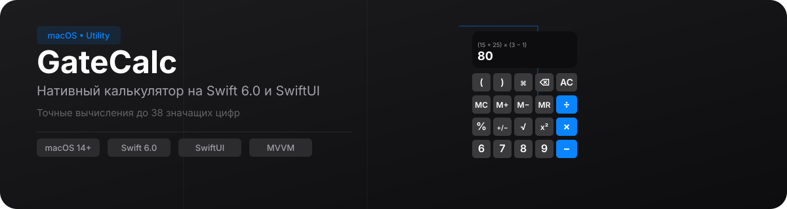

<p align="center">
  
</p>

<p align="center">
  <a href="https://swift.org"></a>
  <a href="https://developer.apple.com/macos/"></a>
  <a href="https://www.swift.org/package-manager/"></a>
</p>

## Что это

Нативный калькулятор для macOS, вдохновлённый Calculator.app из macOS Tahoe. Написан на Swift 6.0 с использованием SwiftUI и архитектуры MVVM — вычислительный движок отделён от UI и полностью потокобезопасен (`Sendable`).

## Почему не обычный калькулятор

| Особенность | GateCalc | Обычные калькуляторы |
|---|---|---|
| Точность | Decimal (128-бит, до 38 значащих цифр) | Double / Float (64-бит, ~15 цифр) |
| Относительный % | `100 + 5%` = 105 | Только абсолютный: `100 × 5%` = 5 |
| Системы счисления | HEX (`0xFF`), BIN (`0b1010`), OCT (`0o77`) | Только десятичные |
| История вычислений | До 50 записей, восстановление в дисплей | Нет |
| Память | MC / M+ / M− / MR с индикаторами | Есть (не всегда) |

## Возможности

### Базовая арифметика

Сложение, вычитание, умножение и деление с точными вычислениями (тип `Decimal`, до 38 значащих цифр). Поддержка приоритетов операторов и вложенных скобок:

```
(15 + 25) × (3 − 1) = 80
((10 / 2) + 3) × 4 = 32
```

### Проценты

Поддержка как абсолютного, так и относительного процента:

- `100 × 5%` = **5** (абсолютный)
- `100 + 5%` = **105** (относительный — как в Windows Calculator)

### Функциональные кнопки

- **Квадратный корень (√)** — извлечение корня из неотрицательного числа
- **Возведение в квадрат (x²)** — точное вычисление через Decimal

### Форматы чисел

| Система | Примеры |
|---|---|
| Шестнадцатеричный | `0xFF`, `0XAB` |
| Двоичный | `0b1010` |
| Восьмеричный | `0o77` |
| Экспоненциальная запись | `1.5e3`, `1.5e−2` |
| Разделители тысяч | пробелы (`37 878`) и запятые (`1,000,000`) |

### Скобки

Полная поддержка круглых скобок для управления порядком вычислений, включая вложенные:

```
(2 + 3) × (4 − 1) = 15
((10 / 2) + 3) × 4 = 32
```

### Copy / Paste

- **Копирование результата** — кнопка на панели или ⌘C
- **Вставка выражения из буфера** — кнопка на панели или ⌘V; вставленное выражение автоматически вычисляется

### Память

Операции MC, M+, M−, MR для сохранения и восстановления промежуточных значений.

### История вычислений

Все успешные вычисления сохраняются в истории (до 50 записей). Каждую запись можно восстановить — выражение и результат подставляются обратно на дисплей.

## Клавиатура

| Клавиша | Действие |
|---|---|
| `Escape` | Полная очистка (AC) |
| `Backspace` | Удаление последнего символа |
| `Return` / `Enter` | Вычислить (=) |
| Цифры, операторы `+`, `-`, `*`, `/`, скобки, `%` | Ввод с клавиатуры |
| ⌘C | Копировать результат |
| ⌘V | Вставить из буфера обмена |

## Архитектура

```
┌─────────────┐    ┌───────────────┐    ┌──────────────┐
│   SwiftUI    │◄──►│  ViewModel    │◄──►│ Calculator   │
│   Views      │    │ @Observable   │    │  Engine      │
│              │    │               │    │ Sendable     │
└─────────────┘    └───────────────┘    └──────────────┘
                          ▲                    ▲
                          │                    │
                   ┌──────┴──────┐      ┌───────┴───────┐
                   │  Services   │      │ Tokenizer     │
                   │ History     │      │ Parser        │
                   │ Clipboard   │      │ Evaluator     │
                   └─────────────┘      └───────────────┘
```

- **Views** — SwiftUI компоненты (дисплей, кнопки, история)
- **ViewModel** (`@MainActor @Observable`) — состояние приложения, ввод/вычисление/память
- **CalculatorEngine** (`Sendable`) — потокобезопасный движок: Tokenizer → Parser (Shunting Yard) → Evaluator

## Сборка

Проект использует Swift Package Manager. Для сборки выполните:

```bash
swift build
```

Для запуска консольного тестера вычислительного движка:

```bash
swift run CalculatorApp
```

## Структура проекта

```
Sources/
├── App/                    — Точка входа, обработчик клавиатуры
├── Views/                  — UI-компоненты (дисплей, кнопки, история)
├── ViewModels/             — Логика приложения (ввод, вычисление, память)
├── Services/               — Сервисы (история)
├── CalculatorEngine/       — Вычислительный движок (токенизатор, парсер, evaluator)
│   ├── Tokenizer/          — Токенизатор (Tokenizer, Token, BinaryOperator)
│   ├── Parser/             — Парсер (Parser, Precedence)
│   ├── AST/                — AST (ExpressionNode)
│   ├── Evaluator/          — Вычислитель (Evaluator)
│   └── Errors/             — Ошибки (CalculatorError)
├── Clipboard/              — Буфер обмена
├── Formatting/             — Форматирование чисел
├── Theme/                  — Цветовая схема
├── History/                — Модель записи истории
└── TestRunner/             — Консольный тестер (executable target)

Tests/
├── Unit/                   — Юнит-тесты (CalculatorTests)
│   ├── EvaluatorTests.swift
│   ├── TokenizerTests.swift
│   ├── ParserTests.swift
│   ├── CalculatorEngineTests.swift
│   ├── CalculatorViewModelTests.swift
│   ├── HistoryServiceTests.swift
│   └── NumberFormatterServiceTests.swift
└── UI/                     — UI-тесты (CalculatorUITests, требуют Xcode)
    └── CalculatorUITests.swift
```

## Лицензия

© 2026 GateCalc. Все права защищены.
